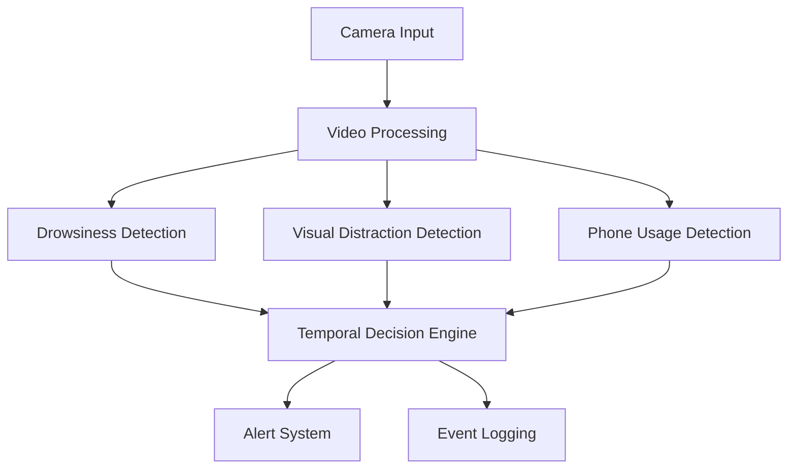

# System Architecture

## 1. High-Level Architecture

The following diagram illustrates the main components
and data flow of DriveSense AI.

```mermaid
flowchart TD
    A[Camera Input] --> B[Video Processing]

    B --> C[Drowsiness Detection]
    B --> D[Visual Distraction Detection]
    B --> E[Phone Usage Detection]

    C --> F[Temporal Decision Engine]
    D --> F
    E --> F

    F --> G[Alert System]
    F --> H[Event Logging]
```
